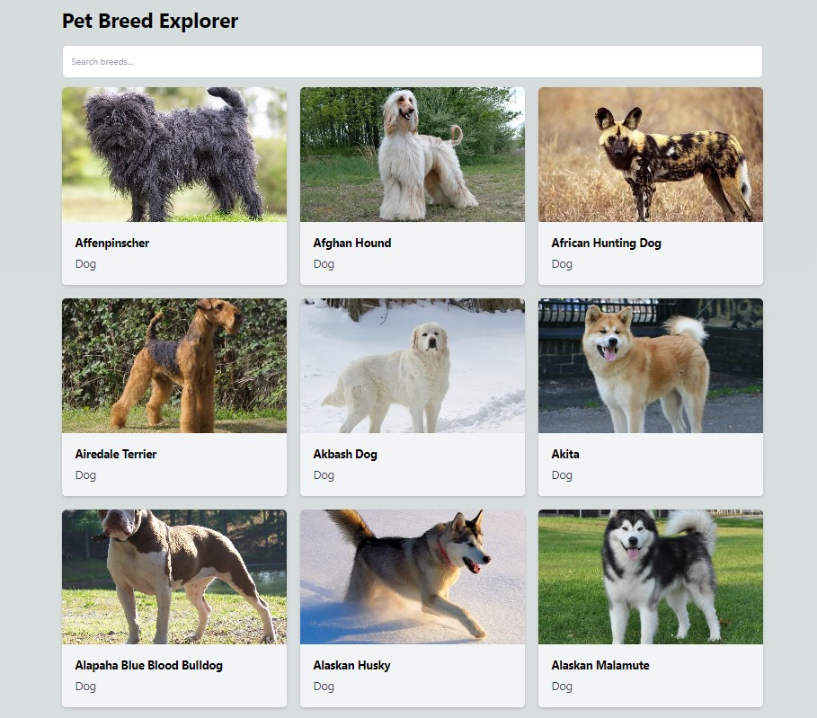

<h1 align="center">Pet Breed Explorer</h1>

Pet Breed Explorer is a web application designed to help users explore various breeds of cats and dogs. It provides a searchable list of breeds, each with detailed information and images.

## Features

- **Search Functionality**: Users can search for breeds by name. As users type into the search bar, the list of breeds is filtered in real-time.
- **Breeds List**: Displays a list of cat and dog breeds with their images.
- **Card Details**: Shows a detailed information about the breed

## Tech Stack

- **Frontend**: Built with Next JS and Tailwind CSS.
- **API**: Fetches breed data from external APIs:
  - [The Dog API](https://thedogapi.com/)
  - [The Cat API](https://thecatapi.com/)